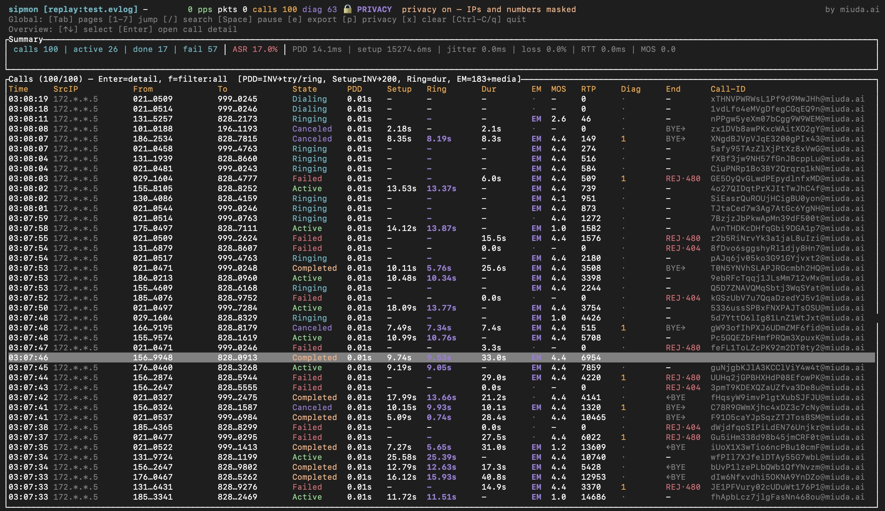
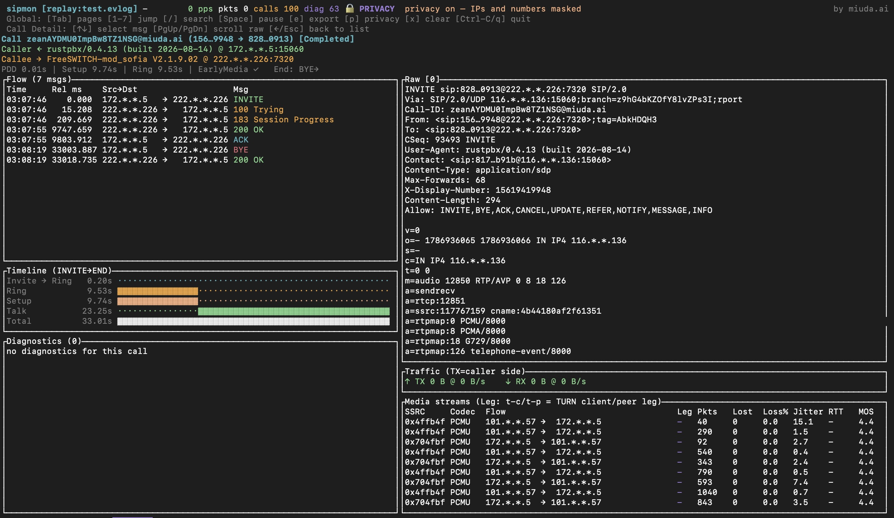

# sipmon

A passive SIP/RTP signaling and media quality monitoring tool. A standalone Rust
executable deployed on a mirrored port / packet capture box, **with no dependency
on a running PBX**. Inputs may be a live capture, a pcap file, a stdin stream, or a
previously recorded event log; output is a live TUI monitor plus exportable
analysis results (JSONL).

## Demo

Animated walkthrough (recorded with [asciinema](https://asciinema.org), driven by
a live `sipbot` caller/callee pair plus a synthetic load pcap). Source recording:
`demo/demo.cast` — replay it with `asciinema play demo/demo.cast`.


Screenshots — call list (Overview) and Call Detail:





## Features

- **Multiple input sources**: live interface (libpcap + BPF), offline pcap/pcapng, stdin `tcpdump -w -` stream, event-log replay
- **Three modes**: `live` interactive monitoring / `record` recording with live TUI on a tty (`--headless` = no UI, `-d` daemonizable) / `replay`
- **SIP correlation**: Call-ID call state machine, transactions (branch+method), Call-ID / number / IP / SSRC indexes, SIP-over-TCP reassembly
- **Media quality**: RFC3550 jitter/loss (64-packet reorder window), RTCP RR LSR/DLSR RTT, one-way delay estimate, E-model MOS
- **TURN detection**: auto-learns TURN servers and labels `turn-client` / `turn-peer` relay legs
- **Diagnostics**: 20+ rules for Contact reachability, Record-Route, SDP/RTP consistency, one-way media, TURN allocation/refresh, etc.
- **TUI**: Overview / Search / Call Detail (side-by-side) / Heatmap / Streams / EventLog / IP Stats
- **Call analysis**: PDD/setup/ring timing, ring-back type (180 vs 183 early media), hangup initiator (caller/callee BYE, CANCEL, reject), per-IP loss over 1s…1h windows
- **Export**: JSONL on exit or via the `export` subcommand; `query` fetches a Call-ID flow for scripting

## Build

```sh
# GNU dynamic link (development)
cargo build

# Static musl release (deploy to a dependency-free target machine)
# Requires a musl build of libpcap first (see below), then:
LIBPCAP_LIBDIR=/path/to/musl/libpcap/lib LIBPCAP_VER=1.10.4 \
  cargo build --release --target x86_64-unknown-linux-musl
# Artifact: target/x86_64-unknown-linux-musl/release/sipmon (statically linked)

# Cross-compile libpcap (musl)
#   wget https://www.tcpdump.org/release/libpcap-1.10.4.tar.gz
#   tar xf libpcap-1.10.4.tar.gz && cd libpcap-1.10.4
#   CC=musl-gcc ./configure --host=x86_64-unknown-linux-musl \
#     --disable-shared --enable-static --prefix=$PWD/install
#   make -j && make install
```

## Quick start

```sh
# Live monitoring (all interfaces, opens TUI)
sipmon live -i any

# SIP on port 5060 only
sipmon live -i eth0 -f "udp port 5060"

# Record live with a watch TUI on a tty (--headless for no UI; -d daemonizes, always no UI)
sipmon record -i any -w cap.evlog --headless

# Continuous background recording to an event log (daemon), replayable/queryable/exportable later
sipmon record -i any -w cap.evlog -d --pidfile /run/sipmon.pid --logfile /var/log/sipmon.log

# Replay a past recording (opens TUI)
sipmon replay -l cap.evlog

# Offline pcap analysis
sipmon file -r capture.pcap

# Default input: pass a filename directly (no subcommand)
#   *.pcap / *.pcapng  → equivalent to `file -r`
#   *.evlog            → equivalent to `replay -l`
#   *.jsonl            → load a snapshot export for viewing
sipmon capture.pcap
sipmon cap.evlog
sipmon out.jsonl

# Read a tcpdump stream (live forwarding)
tcpdump -i eth0 -w - | sipmon -
```

## Command reference

| Command | Description |
|---|---|
| `(none)` | Default mode: a positional `FILE` is dispatched by extension — `.pcap/.pcapng` → `file -r`, `.evlog` → `replay -l`, `.jsonl` → load a snapshot export; with no FILE, starts a live capture. `--no-tui` for headless output |
| `live` | Live capture + TUI. `-i any` captures all interfaces, `-f` sets a BPF filter, `--no-media` disables RTP/RTCP analysis, `-w` optionally writes an event log too |
| `record` | Recording: live capture → event log (`-w` required). Live TUI on a tty; `--headless` disables the UI (non-tty/`-d` contexts are headless automatically). `-d` daemonizes, `--pidfile` writes the PID, `--logfile` redirects stderr. Flushes gracefully on SIGTERM/SIGINT |
| `-` | Read a pcap byte stream from stdin (a `tcpdump -w -` pipe) |
| `file` | Offline pcap/pcapng. `--rate 1x` replays at a real-time speed multiplier, `--no-tui` for headless output, `--print-events` prints structured events |
| `replay` | Replay an event log (TUI / `--no-tui`) |
| `query` | No TUI; exports flow + stream stats + RTT + diagnostics for a Call-ID from an event log (script friendly) |
| `export` | Rebuilds a snapshot from an event log and exports JSONL, with `--from/--to` time filtering (Unix seconds) |

### Common options

```
--dry-run            In-memory analysis only, writes no files (record still always persists)
--max-calls N        Max calls retained in memory (default 100000; evicts oldest terminated first)
--max-streams N      RTP stream ring cap (default 50000)
--max-diagnostics N  Diagnostics ring cap (default 50000)
--diag-level X       info|warn|critical (default warn)
--turn-servers IP,…  TURN server IP list (auto-learning is also supported)
--raw-truncate N     Truncate stored raw SIP messages to N bytes
--bucket 15m|1h|1d   Heatmap bucket granularity (default 15m)
-w/--evlog PATH      Write the binary event log to PATH
--export-jsonl PATH  Export JSONL on exit
```

## TUI usage

### Pages

| Page | Key | Content |
|---|---|---|
| **Overview** | `1` | Summary cards (active/completed/failed, avg PDD/jitter/loss, ASR) + call table |
| **Search** | `2` or `/` | Search Call-ID / From / To / remote IP / SSRC; `Enter` opens the call |
| **Call Detail** | `3` | Details for the opened call (see below) |
| **Heatmap** | `4` | Per-IP packet-loss grid over time; `s` sort, `w` window |
| **Streams** | `5` | Per-RTP-stream live stats table (SSRC/Codec/loss/jitter/RTT/MOS) |
| **Event Log** | `6` | Diagnostics and call-state-change events |
| **IP Stats** | `7` | Per-IP network stats: time-windowed loss, volume, heatmap, drill-down |

### Top bar

3 rows: **row 1** source/duration/pps/packet count/call count/diagnostics count/pause state/status message; **row 2** global shortcuts; **row 3** page-specific shortcuts.

### Global keys

```
Tab / Shift-Tab   Switch page (1 → 7 → 1 …; the bottom tab bar highlights it)
1-7               Jump to the matching page
/                 Search (enters Search edit mode)
Space             Pause / resume
e                 Export the current snapshot as JSONL (sipmon-export-*.jsonl)
x                 Clear all calls/stats (in-memory; the evlog keeps writing)
q / Esc / Ctrl-C  Quit
```

A 1-7 page tab bar is pinned to the bottom of every page; the active page is
highlighted.

### Call table columns

```
Time From To State PDD Setup Ring Dur MOS RTP Diag End Call-ID
PDD    INVITE → first provisional (100 Trying / 180·183)   Ring   ring duration · 180/183 code
Setup  INVITE → 200 OK (answer)                End    who hung up: BYE→ (caller),
                                                   ←BYE (callee), CANCEL, REJ·486
```

### IP Stats page

Per-IP network conditions, aggregated from every RTP/RTCP packet and stream
loss. Each IP's traffic is split by direction — **TX** = sent by the IP
(egress), **RX** = received by the IP (ingress):

```
IP   Act  TX pkts  RX pkts  TX bytes  RX bytes  TX loss%  RX loss%
Act        concurrent active calls involving the IP
TX/RX      count, bytes and loss % for each direction (all-time)
```

- **Loss-only summary**: `c` collapses the table to just `IP  Act  TX loss%
  RX loss%` for a single window; `w` cycles the window (1s→…→1h→all). `c`
  again restores the full table.
- **Bottom heatmap**: loss% over time for every IP; `w` cycles the window
  (last 1m → 10m → 1h). Hidden in loss-only mode.
- **Sort**: `s` cycles `newest` → `max-loss` → `min-loss`. The row order
  refreshes at most every 5s so the list doesn't reshuffle while traffic
  updates the loss numbers.
- **Drill-down**: `Enter` on an IP lists the calls involving it (with their
  packet/MOS/hangup summary); `Enter` on a call opens the full Call Detail,
  `Esc`/`←` returns to the IP list.

### Call Detail side-by-side layout

Opening a call shows a fixed four-pane layout. In Overview/Search, `Enter` opens the selected call (defaults to the first row when nothing is selected):

```
┌ Top bar ───────────────────────────────────────────┐
│ Call <id> (from → to) [state]                      │
├───────────────────┬────────────────────────────────┤
│ Flow message list │ Raw (headers + SDP of the      │
│ (selectable) 4/5  │ selected message) 2/3          │
│                   │                                │
├───────────────────┤────────────────────────────────┤
│ Diagnostics 1/5   │ Network (media stream stats) 1/3│
└───────────────────┴────────────────────────────────┘
```

- **Left top (4/5)**: Flow — chronological SIP message list; `↑`/`↓` selects a message.
- **Left bottom (1/5)**: Diagnostics for the call.
- **Right top (2/3)**: Raw — full bytes of the selected message (`PgUp`/`PgDn` scrolls long text).
- **Right bottom (1/3)**: Network — traffic totals (TX=caller) + per-stream media table.

Keys inside Call Detail:

```
↑ / ↓        Select a message in the left Flow table (Raw follows)
PgUp/PgDn   Scroll long Raw text
← / Esc      Back to the list (Overview)
```

## Event log format

Private binary append-only format (`EvlogWriter`/`EvlogReader`). The header holds the `SMON` magic, version, and timezone; records are `ts_delta | ev_type | len | payload`. Event types:

```
1 SipMsgEvt        { flow, call_id, cseq, branch, method|status, from/to_tag, raw[≤truncate] }
2 TxnEvt           { call_id, branch, method, response_code, delay_ms }
3 CallEvt          { call_id, kind: Setup|Update|Teardown, state, timestamps, cause }
4 StreamSnapEvt    { call_id, ssrc, flow, codec, packets, lost, jitter_ms, ts_window_us }  // every 5s
5 RtcpRttEvt       { call_id, ssrc, ts_us, rtt_ms, oneway_ms }
6 HealthBucketEvt  { bucket_us, dim_key, metric_set }
7 ErrorEvt         { ts, kind, msg }
8 DiagEvt          { ts, call_id, severity, code, message }
```

**No raw RTP payload is stored** — only the summaries needed to rebuild the analysis, plus the truncated raw SIP messages (`--raw-truncate` controls the cap).
`record` always writes to disk; `live` needs an explicit `-w`.

## Diagnostic codes

| Code | Meaning |
|---|---|
| `CONTACT_UNREACHABLE` | Contact address unreachable (loop/blackhole) |
| `CONTACT_PRIVATE_NAT` | Contact uses a private address; NAT/relay may be required |
| `CONTACT_MCAST` | Contact is a multicast address |
| `RR_NOT_HONORED` / `RR_DEPTH_MISMATCH` | Record-Route not honored / depth mismatch |
| `SDP_HOLD` | SDP carries hold (`sendonly`/`inactive`) |
| `RTP_PT_MISMATCH` / `RTP_PT_CHANGED` / `RTP_FLOW_UNEXPECTED` | Payload type mismatch / changed mid-call / RTP flow disagrees with SDP |
| `ONE_WAY_MEDIA` | One-way media (only receiving, not sending) |
| `TURN_ALLOC_OK` / `TURN_ALLOC_FAILED` / `TURN_REFRESH_FAILED` | TURN allocation succeeded / failed / refresh failed |
| `TURN_RELAY_MEDIA` / `TURN_CHANNEL_MEDIA` / `TURN_SEND_IND_MEDIA` | Media relayed via TURN Relay / ChannelData / Send-Ind |
| `TURN_LEG_IMBALANCE` | TURN leg packet imbalance (suspected one-way) |

## Metric definitions

- **RTT**: `RTT = arrival_NTP − LSR − DLSR` from the RTCP RR
- **One-way delay**: RTCP SR NTP↔RTP mapping (when both directions are visible); otherwise an indirect estimate from RTP arrival intervals (labeled "estimate")
- **jitter/loss**: RFC3550, 64-packet reorder window
- **MOS**: simplified E-model (G.107): `R = 93.2 − Id − Ie`, labeled "estimate"

## Limitations

- TLS/SRTP encrypted payloads cannot be parsed; capture at the decryption point
- Absolute one-way delay under one-way passive observation is an estimate; RTCP RTT is the primary metric
- Capturing without interface permissions requires root / elevated privileges (same as tcpdump)

## Tests

```sh
cargo test                       # unit + integration tests (pcap fixture)
cargo test --test cli_integration
```
